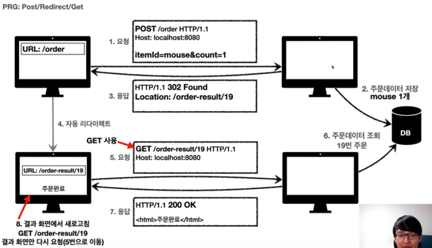

# 네트워크

## 면접 대비 질문

  
웹 통신의 큰 흐름: https://www&#46;google&#46;com/ 을 접속할 때 일어나는 일

   
  
사실상 이 질문은 책 한권을 요약해보라는 뜻이 아닐까 싶습니다 ㅎㅎ(그 만큼 전체적인 흐름을 정리해야 대답할 수 있는 질문인 것 같아요. 이 질문에 대해서 OSI 7 계층과 최대한 엮어서 제 나름대로 답변을 정리해봤습니다.

   우선 OSI7계층을 응용(표현, 세션), 전송, 네트워크, 데이터링크, 물리계층으로 이루어져 있습니다. 
1. 저희가 웹 브라우저에서 주소를 입력하면 3-WAY Handshake가 완료되어서 연결이 확립이 됩니다. 
2. 컴퓨터에서 응용계층으로 내려가면서 웹 서버의 html 데이터를 얻기 위해 get/ HTTP 메세지를 보냅니다. 
3. 응용계층에서 출발지 및 도착지 포트번호의 정보가 담긴 TCP 헤더를 붙여서 전송계층으로 보내줍니다.(도착포트는 HTTP:80 HTTPS:443이고 보내는 포트는 무작위 랜덤입니다. TCP헤더가 붙은 데이터는 세그먼트라 합니다). 
4. 전송계층의 세그먼트에 IP헤더가 붙어서 네트워크 계층으로 내려가며 이 데이터를 IP패킷이라 합니다. 
5. 네트워크 계층에서 라우터 및 컴퓨터의 MAC 주소가 붙은 이더넷 헤더가 붙어서 데이터 링크로 내려가게 됩니다.(이더넷 헤더가 붙은 데이터를 이더넷 프레임이라고 합니다) 
6. 데이터 링크에서 물리계층으로 보내주어 전기신호로 변환되 전송하게 됩니다. 
7. 전기신호 전송하면서 다음 라우터까지 전송하게 되고 IP패킷까지 언캡슐화합니다. 각각의 IP마다 라우터의 라우팅 테이블을 통해 보내는 방향을 설정해줄 수 있습니다. 그러므로 다시 캡슐화해서 7번 과정을 반복해서 Server로 도착하게 됩니다.
8. Server로 도착한 이후에 도착지, 출발지 위치만 바뀌고 다시 Client에 정보를 보냅니다.

  
TCP/IP에 대해 얘기해보시오

   
  
IP 프로토콜만으론 한계가 있습니다. 상대방과 저가 연결이 제대로 되있는지, 패킷의 전송 순서가 순서대로 갔는지, 어떤 애플리케이션에 보내야 하는지를 모릅니다.

    이러한 문제점들을 해결하기 위해 전송계층에서 Transmission Control Protocol(TCP)를 통하여 연결지향적이고(TCP 3 Way handshake) 데이터 전달 보증 및 순서를 보장할 수 있습니다.

  
TCP와 UDP의 차이점

   
  
TCP는 연결형 통신 프로토콜로 TCP헤더가 붙은 데이터를 세그먼트라 부릅니다. 이 TCP헤더 안에 코드비트가 있고 코드비트안에 SYN, ACK 비트를 통해 가상의 통신로인 연결(connection)을 만들 수 있습니다

    UDP는 비연결형 통신으로 UDP헤더가 있는 데이터를 데이터그램이라 하고 연결이 되있는지와 무관하게 보내기 때문에 브로드캐스트와 같이 영상을 보낼 때 효율적입니다. 브로드캐스트는 데이터링크 계층에서 스위치에서 상대 컴퓨터의 ip주소를 알고 mac 주소를 모를 때 브로드캐스트를 통해 ARP 요청을 해 MAC 주소를 알아낼 수 있습니다. 그러나 요새 HOT해지고 있습니다.

  
TCP의 3-Way handshake

   
  
TCP의 가상 통신로인 연결을 확립하기 위해  
      1. 연결 요청을 보냅니다(SYN) 
2. 연결 확인 응답과 동시에 연결 요청(ACK, SYN)를 보냅니다 
3. 처음 연결 요청을 보낸 컴퓨터에서 연결 확인 응답(ACK)를 보냅니다 
      4. 위와 같은 연결 이후에 연결 종료 요청을 각각의 컴퓨터에서 보내고 응답을 받습니다.

위와 같이 연결이 제대로 되지 않는다면 데이터를 보내지 않습니다. 
또한 3-Way handshake는 단순히 연결 확보 뿐 아니라 패킷의 순서 및 손실된 데이터에 한해 재선송 제어를 담당합니다.

  
HTTP와 HTTPS의 차이점에 대해서 설명해보세요.

   
  
HTTP는 따로 암호화 과정을 거치지 않기 때문에 중간에 패킷을 가로챌 수 있고, 수정할 수 있습니다. 따라서 보안이 취약해짐을 알 수 있습니다. 이를 보완하기 위해 나온 것이 HTTPS입니다. 중간에 암호화 계층을 거쳐서 패킷을 암호화합니다.

  
GET과 POST 차이에 대해 설명해보시오.

   
  

	GET은 조회, POST는 요청에 주로 사용됩니다. 

	

        GET은 캐싱이 되기 때문에 조회는 GET으로 설계하는 것이 좋고 POST는 서버에 정보를 생성하는 것을 요청합니다. 삭제, 수정과 같은 경우도 POST로도 수행은 가능합니다. 
보통 메세지 Body는 GET은 없고, POST는 있게 요청하는게 일반적입니다.

  
HTTP 메서드와 역할에 대해 설명해보세요.

   
  

POST(파일 그 외 어지간한 모두) PUT(파일 관리)

  
HTTP 1.1과 2.0의 차이를 설명해주세요

   
  

  	HTTP1.1은 기본적으로 연결 하나와 응답 하나로 처리하기 때문에 동시전송 및 다수의 리소스 처리에는 속도가 느리다는 단점이 있었습니다. 이러다 보니 응답 지연 및 무거워지는 Header의 문제점이 있었습니다. 
  	이럴 때 HTTP2.0이 한 번에 여러개의 메세지를 주고받을 수 있고 헤더 압축전송 방식을 사용해 많은 기능을 향상시켰습니다. 
      1.1은 매번 3 way handshake를 해야되므로 시간이 걸려서 keep alive(지속연결)를 기능이 도입해 데이터 연결이 끝날 때까지 연결을 유지함. 
       
(대부분 1.1을 쓰는게 현 상황)
  

  
HTTP 프로토콜의 특징에 대해 설명해주세요(State, connection)

   
  
HTTP 특징으론 크게 두 가지가 있습니다.

    첫 번째론 stateless(무상태) 한 것입니다. stateless하면 연결을 끊는 순간 클라이언트의 상태 정보를 저장하지 않습니다. stateless의 특징으론 클라이언트당 서버가 변경돼도 괜찮기 때문에 서버의 확장 및 효율적인 사용에 용이하지만 클라이언트의 요청이 갈수록 무거워지는 것과 로그인과 같은 상태유지가 필수적인 경우에는 쿠키 및 세션으로 처리합니다. 
    두 번째론 connectless(비연결성)입니다. 클라이언트가 request를 보내고 response 응답을 해주면 바로 연결을 끊습니다. 이유로는 모든 클라이언트들과 연결하면 지나치게 비효율적이므로 비연결성을 기본으로 유지하는 것이 중요합니다. 
    그러나 단점으로 새로 연결을 맺는 것은 3 way handshake와 같이 연결을 맺고 새로운 자원들을 다시 다운로드해야 하므로 비효율적이기도 합니다. 이러한 문제점들을 HTTP의 지속연결로 해결할 수 있습니다. 

  
HTTP 상태코드와 상황에 따른 코드 설계에 대해 설명해주세요

   
  

## 인프런 강의 요약

### 인터넷 네트워크

- IP(인터넷 프로토콜)

  - 기본적으로 통신은 IP 프로토콜로 내 IP, 상대 IP를 통해서 연결된다
  - 그러나! 한계는 있으니
  - IP프로토콜의 문제를 해결하기 위해 TCP/UDP 프로토콜 출현(전송계층)

  

- IP 프로토콜의 한계로 인한 TCP 등장

- IP만으론 애플리케이션 구분이 힘듭니다(게임, 웹브라우저, 카톡 등등 -> 포트 번호로 구분가능) 그래서 TCP에서 PORT 정보, 순서, 제어와 같은 정보를 포함해서 보냄(포트는 항구번호라는 의미)
- TCP 특징
  - 연결지향(TCP 3 Way Handshake)
  - 데이터 전달 보증
  - 순서 보장

- 보통 TCP랑 IP 합쳐서 TCP/IP 패킷이라함

### URI와 웹브라우저 요청 흐름

- URI(uniform resource identifier)
- URI는 URL과 다르며 로케이터(locator), 이름(name) 또는 둘다 추가로 분류될 수 있다
- URN은 김동찬이고 URI는 방배역 어디에 사는 김동찬 이런 차이가 있음
- URI는 리소스 식별자이고 URL은 리소스의 위치를 얘기해주는 것? 차이가 애매함

### HTTP(Hypertext Transfer Protocol)

- 모든 것을 HTTP메세지로 전송(이미지, 음성, HTML, JSON, XML, 서버간 통신)
- HTTP/1.1 이 제일 많이 사용(TCP)
- HTTP/2: 성능개선(TCP)
- HTTP/3 : 진행 중, TCP 대신 UDP 사용 -> 3 Way Handshake를 사용안하니 속도 up

HTTP 특징

- 클라이언트 서버 구조

  - Request / Response 구조로 클라이언트와 서버가 분리된 구조임
  - 복잡한 데이터와 같은 건 서버가 UI, UX는 클라이언트가 담당하기 때문에 각자 발전이 가능함
  - 모든 통신은 Request <--> Response로 이루어짐

- 무상태 프로토콜(stateless)

  - 서버가 클라이언트의 상태를 보존하지 않음
  - 그러므로 모든 점원이 알아들을 수 있게 질문을 확장해서 자세히 하는 것
  - 서버가 에러나도 클라이언트한테는 문제 발생 X(이전 점원과는 관련이 없으므로)
  - 응답 서버를 쉽게 바꿀 수 있으므로 서버의 무한한 증설 가능
  - 또한 끝없이 확장가능하지만 단점으론 데이터를 많이 보내야 함
  - 또한 로그인과 같이 상태를 유지해야 되는 경우도 있음. 그러므로 쿠키, 세션을 이용해 상태유지

- 비연결성(connectionless)

  - 수천명이 사이트를 사용한다해도 실제 서버와 통신은 버튼을 누를 때만(자원 사용 효율적)

  - 서버의 자원절약을 위해 TCP/IP 연결하고 응답하고나서는 연결 끊음

  - 그러나 3 way handshake 로 인한 시간도 추가되고 수 많은 자원도 다운로드가 다시 되야하니까 낭비가 되기도함 ex) 연결하고 HTML받고 끊고 연결하고 JS받고 끊고.. 반복

    -> 지속연결(persistent connections)로 한 번에 전부 받고 끊음. 계속 발전하는 중

- HTTP 메세지 구조

  

HTTP 요청 메세지(HTTP 메서드) & 응답 메세지

- 시작라인: GET/ 절대경로  & 상태코드
- 헤더: Field name & HTTP 전송에 필요한 모든 부가정보
- 메세지바디: & 실제 전송할 데이터(HTML, JSON 등등 모든 데이터)

HTTP는 단순하지만 확장가능한게 가장 큰 특징! 성공의 가장 큰 요소 ㅎㅎ

### HTTP 메서드

HTTP API 설계방법(API URI 설계에 대한 고민)

잘못된 예시(CRUD)

적절한 예시(URI는 최대한 리소스만 사용하기, 미네랄을 캐기가 아니라 미네랄만 리소스임)

즉 리소스(자원, 미네랄) + 메서드(행위)

But 현실은 그렇게 녹록치 않음(order) -> 어쩔 수 없이 리소스가 아니여도 사용해야 할 때가 있음

HTTP 메서드 종류

- GET: 리소스 조회
  - 서버에 요청하고 싶은 데이터를 query를 통해 전달
  - 메세지 바디를 사용해서 데이터를 전달가능하지만 지원하지 않는 곳이 많아 사용하지 않음
  - GET과 HEAD는 캐쉬 저장이 되기 때문에 되도록 조회는 GET으로

- POST: 요청 데이터 처리, 주로 등록에 사용
  - 대상 리소스가 리소스의 고유한 의미 체계에 따라 요청에 포함된 표현을 처리하도록 요청
  - 메세지 바디를 통해 서버로 요청 데이터 전달
  - 서버에서 무작위로 신규 리소스 식별자 생성(위치 random하게 생성)
  - HTML 양식의 프로세스 처리(회원가입, 주문, 게시판 글쓰기, 댓글 쓰기)
  - 배달(주문) 요청: POST/orders/orderId/start-delivery (컨트롤 URI)
  - 다른 메서드로 처리하기 애매하면 POST로 처리(JSON데이터 GET해야하는 상황)
- PUT: 리소스 대체, 리소스가 없다면 생성(완전 대체)
  - 아예 덮어쓰기가 PUT(게시글 글 수정하기 같은 경우)
  - 클라이언트가 리소스 위치를 알고 URI를 지정해야함(POST와의 차이)
    - ex) PUT/members/100 HTTP/1.1
- PATCH: 리소스 부분 변경
  - 일부부만 변경하고 싶을때 사용(보내는 데이터 중 없는 데이터는 냅두기)
- DELETE: 리소스 삭제
- HEAD: GET과 동일하지만 메세지 부분을 제외하고 시작라인, 헤더만 반환
- OPTIONS: 대상 리소스에 대한 통신 가능 옵션을 설명(CORS에서 사용)

캐쉬는 GET, HEAD만 가능(PATCH 이외에도 가능하지만 사실 너무 복잡함 사용하기에)

### HTTP 메서드의 속성

- 안전(Safe Methods)
  - 호출해도 리소스를 변경하지 않는 것을 안전하다 함
  - GET은 조회만 하므로 변경하지 않으니까 안전함
  - POST, DELETE는 변경이 일어나니까 안전하지 않음
- 멱등(Idempotent Methods)
  - 한 번 호출하든 두 번 호출하든 결과가 같은 것 (f(x) == f(f(x)))
  - GET: 조회는 몇 번해도 결과가 같음(멱등)
  - PUT: 결과를 대체하므로 몇 번 같은 요청을 해도 결과가 같음(멱등)
  - DELETE: 삭제는 몇 번 삭제해도 삭제된 결과는 동일함(멱등)
  - POST: 멱등이 아님!! 주문 및 결제는 중복되면 2번 음식배달 옴
  - 멱등 활용법으로 자동 복구 매커니즘이 있음. 서버가 TIMEOUT되서 정상응답을 못 주면 클라이언트가 다시 같은 요청을 할 수 있도록 자동 복구 매커니즘 활용
  - 멱등하면서 중간에 리소스변경되면 결과가 다르지만 이러한 경우는 고려하지 않음
- 캐시가능(Cacheable Methods)
  - GET, HEAD만 캐시 가능
  - POST,P PATCH도 가능은 하지만 본문 내용까지 캐시 키로 구현해야 되는게 쉽지 않음

### HTTP 메서드의 활용

서버 데이터 전달 방식

- 쿼리 파라미터를 통한 데이터 전송 방식
  - GET
  - 정렬 필터(검색어)
- 메세지 바디를 통한 데이터 전송
  - POST, PUT, PATCH
  - 회원가입, 상품주문, 리소스 변경

클라이언트에서 서버로 데이터 전송하는 4가지 상황

- 정적 데이터 조회(GET)
  - 이미지, 정적 텍스트 문서
  - 쿼리 파라미터가 따로 필요하지 않고 리소스 경로만으로 조회 가능
- 동적 데이터 조회(GET)
  - 쿼리 파라미터 사용해서 조회
  - 주로 검색, 게시판 목록에서 정렬, 필터링 할 떄(검색)
- HTML FORM 데이터 전송(POST)
  - 만약 GET로 메서드가 설계되있다면 메세지 body가 없고 쿼리문 조회가 되므로 사용할수 없음
  - 주로 회원가입, 상품주문, 데이터 변경할때 사용
  - 전송데이터를 url encoding 해서 처리 ex)abc김 -> abc@fjiaf%

- HTTP API 데이터 전송
  - HTML FORM 없이 직접적으로 데이터 전송하고 싶을 때
  - 주로 서버 to 서버(백엔드 통신할때 주로 사용)
  - 앱 클라이언트(아이폰, 안드로이드 에서 사용)
  - 웹 클라이언트(HTML FORM대신 자바스크립트를 통한 통신에 사용(AJAX), React, Vue과 같은 웹 클라이언트와 API 통신)
  - GET으로 데이터 조회, POST, PUT, PATCH로 메세지 바디에 데이터 전송
  - Content Type은 옛날에는 XML이였지만 요새는 거의 무조건 JSON
  - HTML Form은 GET, POST만 되지만 HTTP API는 사실상 거의 다 됨(개발할때 AJAX가 편리함!!)

### HTTP API 설계

- 컬렉션: API 설계 - POST 기반 등록
  - 컬렉션(Collection)
    - 서버가 관리하는 리소스 디렉토리
    - 서버가 리소스의 URI를 생성하고 관리
    - 멤버에 관해 method를 한다면 멤버의 컬렉션은 /members

- 스토어: API 설계 파일 관리 시스템 - PUT 기반 등록
  - 등록할 파일의 위치를 내가 알고 있으니까 PUT 사용(완전대체가 적용되는 사례)
  - PUT / files/star.jpg
  - 클라이언트가 관리하는 리소스 저장소

- HTML FORM
  - GET, POST밖에 지원이 안되므로 한계가 있어 AJAX 사용
  - 주소는 최대한 통일시키기(괜히 페이지 바뀌는 경우가 생길수도)

요약

### HTTP 상태코드

- 2XX
  - 200: 요청성공으로 결과반환(Ok)
  - 201: Created로 요청 성공해서 새로운 리소스가 생김(회원 가입 성공)
  - 202: Accepted로 요청은 접수되었으나 처리가 완료되지 않은 것
  - 204: No content로 요청은 성공했으나 본문에 보낼 데이터가 없음
    - 웹 문서 편집기에서 save 버튼 누르면 아무 내용 없이 같은 화면 유지하는 것

- 3XX
  - Redirection은 웹브라우저의 3xx 응답 결과에 Location 헤더가 있다면 Location 위치로 자동 이동하는 것
  - 요청을 완료하기 위해 유저의 추가 조치가 필요한 것
  - 자동 리다이렉트는 a라는 페이지를 요청했을 때 사실 b라는 페이지로 가기 위해서 알아서 a에서 local로 오고 local에서 b를 요청해 응답을 받아오느 과정인데 사용자는 인지하지 못할 정도로 빠름
  - 영구 / 일시 / 특수 리다이렉션 존재
  - 영구 리다이렉션
    - 리소스의 URI가 영구적으로 변경
    - 301: 리다이렉트 시 요청 메서드가 GET으로 바뀌고 본문이 제거될 수 있음
    - 308: 301과 기능이 같고 메서드 유지 -> POST요청(주문, 가입)할 때 사용하지만 대부분 내부적인 요청 데이터 Form이 아예 변경되므로 사용되는 일이 적음
  - 일시적 리다이렉션
    - 리소스의 URI가 일시적으로 변경된것이므로 검색 엔진에서 URL을 변경하면 안됨
    - 302: Found 리다이렉트 요청 시 GET으로 변하고 본문이 제거될 수 있음
    - 303: 리다이렉트시 무조건 GET으로 변경
    - 307: Temporary Redirect 302와 기능은 같고 리다이렉트시 요청 메서드 유지(변경 X)
    - PRG(POST/Redirect/Get)
      - POST 주문하기 이후에 웹 브라우저 새로고침하면 마지막 요청이 POST이기 때문에 다시 POST요청이 가서 중복주문이 될 수 있음
      - 새로고침하면 Redirect해서 결과화면을 GET으로 조회 및 요청해서 중복주문 문제 해결
  - 기타 리다이렉션
    - 304 Not Modified
      - 캐시를 목적으로 사용
      - 클라이언트에게 리소스가 변경안됬으니까 캐시로 리다이렉트해줌
      - 로컬 캐시를 사용하므로 응답에 메세지 바디 포함 X
      - GET, HEAD 요청시에 사용
- 4XX(클라이언트 오류)
  - 이미 요청을 잘못 하고 있으므로 재요청을 해도 실패
  - 400 Bad Request: 잘못된 요청
  - 401 Unauthorized 인증이 필요한 것
    - Authentication: 본인 확인(로그인)
    - Authorization: 권한(로그인 되있어도 관리자는 아닌 것)
    - 401 이름은 unauthorized이지만 사실 Authentication임
  - 403 Forbiddend
    - 권한이 없을때(Authorization)
  - 404 Not Found
- 5XX(서버 오류)
  - 500 서버 에러
  - 503 서비스 이용 불가: 서버의 일시적인 과부하(몇 시간후에 복구되는지 표현 가능)
  - 500 에러는 진짜 서버에 문제가 있을때만 사용하도록 하자

요약

